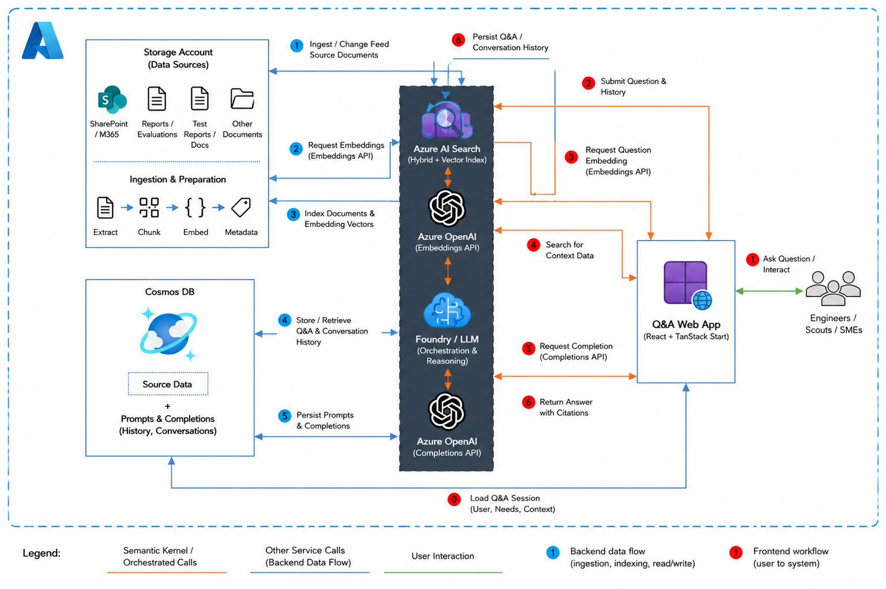

# Digital Scout — Azure AI Technology Discovery Accelerator

Digital Scout is an Azure-native accelerator for organizations that need to discover, evaluate, and operationalize new technologies faster.

It turns fragmented technology-scouting workflows — forms, spreadsheets, email threads, SharePoint sites, vendor notes, test reports, and individual expertise — into a searchable, AI-assisted decision system.

Instead of asking people to know where information lives or who evaluated a technology three years ago, Digital Scout lets them start with a business or engineering problem:

> **"Tell Digital Scout what you are trying to solve."**

The platform then helps define the need, finds relevant internal knowledge, identifies prior evaluations, surfaces potential companies or technologies, captures expert feedback, and maintains traceability through evaluation, pilot, project, and outcome.

---

## Deploy the web app to Azure

Deploy the Digital Scout web app directly into your own Azure subscription. This one-click deployment provisions an **Azure App Service (Linux, Node 22 LTS)** and runs a prebuilt, self-contained package — no build runs in Azure.

[](https://portal.azure.com/#create/Microsoft.Template/uri/https%3A%2F%2Fraw.githubusercontent.com%2FBalunywa%2Fscout-ai%2Fmain%2Fdeploy%2Fazure%2Fazuredeploy.json/createUIDefinitionUri/https%3A%2F%2Fraw.githubusercontent.com%2FBalunywa%2Fscout-ai%2Fmain%2Fdeploy%2Fazure%2FcreateUiDefinition.json)

**How it works:**

1. A GitHub Actions workflow ([.github/workflows/release-webapp.yml](.github/workflows/release-webapp.yml)) builds the SSR app on every push to `main` and publishes a self-contained `scout-ai-app.zip` to the stable `app-latest` GitHub Release.
2. The ARM template ([deploy/azure/azuredeploy.json](deploy/azure/azuredeploy.json)) creates the App Service and sets `WEBSITE_RUN_FROM_PACKAGE` to that release zip URL, so Azure mounts the package read-only and starts it with `node server/index.mjs`.

After deployment completes, open the `webAppUrl` shown in the deployment outputs to reach the running app at `https://<web-app-name>.azurewebsites.net`.

> **Scope:** This deploys the web application only. The backing Azure AI, data, and search services described later in this document are provisioned separately per customer environment.

---

## Run locally

```bash
bun install
bun run dev      # start the dev server at http://localhost:3000
bun run build    # produce the self-contained .output/ SSR bundle
```

---

## Why this exists

Large organizations often have no shortage of technical expertise. The problem is that the expertise is distributed across people, documents, inboxes, business units, and disconnected systems.

That creates a predictable set of problems:

- Teams repeat research that another group has already completed.
- Technology requests become stale because there is no active follow-up loop.
- Vendor and technology evaluations are difficult to find and reuse.
- Engineer feedback remains trapped in email, documents, and personal folders.
- Business units cannot easily see what has already been tested, rejected, funded, or deployed.
- Innovation and R&D teams spend too much time administering intake and too little time evaluating solutions.
- Leadership lacks traceability from an initial technology need to an actual funded project or business outcome.

Digital Scout addresses that gap by making organizational technology knowledge conversational, searchable, reusable, and actionable.

---

## Business Value

Digital Scout is designed to improve the economics and speed of technology discovery — not simply digitize an existing form.

### 1. Reduce duplicate research

Before a new technology request is created, Digital Scout searches prior needs, company evaluations, projects, test reports, engineering feedback, and related documents.

**Business impact:**

- Avoid repeating work that has already been funded or completed.
- Reuse previous technical evaluations across teams and business units.
- Reduce time spent searching SharePoint, email, spreadsheets, and disconnected repositories.
- Preserve institutional knowledge when employees or subject-matter experts move roles.

### 2. Shorten the path from problem to qualified options

Engineers can describe a problem in natural language instead of completing a long intake form. AI helps extract the technical requirements, asks clarification questions, identifies gaps, and returns relevant internal knowledge and potential solutions.

**Business impact:**

- Faster intake and qualification of new technology needs.
- Less manual administration for innovation, scouting, and R&D teams.
- More consistent requirements before vendor engagement begins.
- Faster movement from an idea to a shortlist of technologies worth evaluating.

### 3. Scale specialist knowledge across the organization

A small scouting, engineering, or innovation team can support a much larger population of engineers through a self-service AI experience.

Digital Scout does not replace the specialist. It helps specialists spend their time on high-value evaluation and decision-making rather than repeatedly answering basic discovery questions.

**Business impact:**

- Extend access to technology knowledge beyond a small central team.
- Allow engineers to self-serve common discovery questions.
- Reduce dependency on knowing the "right person" inside the organization.
- Give domain experts a reusable way to capture what they learn.

### 4. Improve technology investment decisions

Digital Scout connects the full lifecycle:

**Need → Candidate Technology / Company → Evaluation → Pilot / Project → Test Report → Outcome**

That gives teams a clear history of why a technology was considered, what was learned, who evaluated it, what risks were identified, and what ultimately happened.

**Business impact:**

- Better evidence before funding pilots or development work.
- Clearer technical and commercial decision history.
- Reduced risk of reconsidering previously rejected solutions without understanding why they failed.
- Better visibility into which scouting activities actually resulted in pilots, projects, products, savings, or revenue.

### 5. Keep technology needs alive and current

Digital Scout can identify stale needs and recommend an action based on new information.

For example:

- A requirement has had no activity for 120 days.
- New companies have entered the market.
- Another business unit recently evaluated a similar technology.
- A new test report changes the previous recommendation.

**Business impact:**

- Reduce abandoned or forgotten requests.
- Revalidate needs against current market conditions.
- Close or merge duplicate requests instead of accumulating backlog.
- Focus scouts and engineers on the needs most likely to create business value.

---

## Where Customers Can Use It

Digital Scout is intentionally broader than IT. Any organization that evaluates external technology, vendors, engineering solutions, or emerging capabilities can use the pattern.

Typical deployment scenarios include:

| Business Area | Example Use |
| --- | --- |
| Engineering & R&D | Find technologies that meet a new technical requirement and reuse previous engineering evaluations. |
| Innovation / Technology Scouting | Manage technology needs, company discovery, evaluations, pilots, and recommendations. |
| Energy & Natural Resources | Scout sensors, materials, coatings, water technologies, automation, power systems, AI, and field technologies. |
| Manufacturing | Evaluate robotics, industrial automation, inspection, materials, predictive maintenance, and plant technologies. |
| Utilities | Discover grid, storage, inspection, vegetation management, field-service, and reliability technologies. |
| Chemicals & Materials | Track new formulations, coatings, catalysts, membranes, and specialty materials. |
| Supply Chain / Procurement | Reuse technical vendor evaluations before starting a new sourcing exercise. |
| Enterprise Architecture | Search prior platform evaluations and understand why technologies were selected or rejected. |
| Corporate Venture / Open Innovation | Connect external companies to internal problems and track what progresses into pilots or investment. |
| AI / Automation Programs | Match business problems to AI capabilities, existing internal work, vendors, and reusable solutions. |

The same accelerator can be adapted to other industries by changing the data model, terminology, evaluation criteria, and example workflows.

---

## What the Customer Gets

The accelerator is intended to be a deployable starting point, not a slide-only reference architecture.

A customer deployment can include:

- A working web application deployed into the customer's Azure environment.
- Microsoft Entra ID authentication and role-based access.
- Conversational technology-need intake.
- AI-assisted requirement extraction and classification.
- Semantic search across structured and unstructured organizational knowledge.
- Similarity and duplicate-need detection.
- Company / technology recommendation workflow.
- Evaluation workspace for engineering and subject-matter experts.
- AI summaries of evaluations, feedback, and reports.
- Technology lifecycle traceability.
- Follow / notification workflows.
- APIs and service abstractions that can be connected to the customer's existing systems.
- Infrastructure-as-code / deployment artifacts for repeatable deployment.
- A clear Azure cost model based on the customer's selected scale and services.

The accelerator should be treated as an MVP foundation that can be extended around the customer's workflow, data, security model, and operating process.

---

## Example Customer Journey

An engineer has a new requirement:

> **"I need a coating for equipment operating in an H₂S environment above 180°C."**

Instead of opening a request form and starting research from zero, the engineer asks Digital Scout.

Digital Scout can:

1. Understand the engineering problem.
2. Ask clarification questions about temperature, pressure, materials, environment, lifecycle, and constraints.
3. Extract a structured technology need from the conversation.
4. Search the organization's previous technology work.
5. Find similar needs submitted by other teams.
6. Surface companies and technologies evaluated previously.
7. Retrieve relevant test reports, engineering feedback, project documents, and decisions.
8. Identify what is already known versus what is still unknown.
9. Recommend candidate companies or technologies worth investigating.
10. Create the new technology need with the relevant context already attached.
11. Route the need to the appropriate technology, engineering, innovation, or evaluation team.
12. Maintain traceability as the technology moves through evaluation, pilot, project, and final outcome.

The value is not simply that AI answered a question. The value is that the organization started from everything it already knew instead of starting from zero.

---

## Core User Experiences

### Ask Digital Scout

The primary experience is conversational.

Users can ask questions such as:

- "Have we evaluated this technology before?"
- "Who inside the company has worked on this problem?"
- "Find companies that meet these technical requirements."
- "Show me previous test reports related to this technology."
- "What are the major risks in the companies we are evaluating?"
- "Do we already have a technology need similar to this one?"
- "What changed since this technology was evaluated two years ago?"

The system returns answers with references to the underlying organizational sources wherever possible.

### Conversational Need Definition

Instead of forcing an engineer through a large form, Digital Scout guides the user through the problem.

AI can extract:

- Problem statement
- Business objective
- Technology domain
- Technical requirements
- Operating environment
- Constraints
- Desired outcome
- Timeline
- Business impact
- Existing approaches
- Technology readiness expectation
- Keywords

The user reviews and edits the extracted information before creating the formal need.

### Organizational Knowledge Search

Digital Scout provides semantic search across the organization's technology knowledge.

Search can include:

- Technology needs
- Company profiles
- Vendor evaluations
- Engineer feedback
- SharePoint content
- Test reports
- Project documents
- Scout / innovation notes
- Technical reports
- Prior recommendations

Results can be grouped by source type and summarized by AI with citations.

### Company and Technology Matching

Digital Scout can rank candidate companies or technologies against a defined need.

A recommendation can show:

- Match score
- Requirements matched
- Requirements not demonstrated
- Technology maturity
- Prior company interactions
- Existing evaluations
- Test results
- Known risks
- Why the recommendation was generated

AI recommendations should remain transparent and traceable to evidence.

### Evaluation Workspace

Subject-matter experts can evaluate a technology without working through a giant static form.

Evaluation dimensions can include:

- Technology fit
- Technical maturity
- Commercial maturity
- Integration complexity
- Scalability
- Differentiation
- Strategic relevance
- Risk
- Testing requirements
- Recommendation

Users can add comments, upload documents, record test results, attach supporting material, and capture decisions.

AI continuously summarizes the evidence and can generate an emerging recommendation for review by the evaluation team.

### Technology Journey / Traceability

Every technology can maintain a visible lifecycle:

```
Need
  ↓
Candidate Companies / Technologies
  ↓
Evaluation
  ↓
Pilot / Project
  ↓
Test Report
  ↓
Business Outcome
```

This lets customers answer questions such as:

- What happened after this technology was identified?
- Why was this company rejected?
- Which evaluations became funded pilots?
- Which pilots became production capabilities?
- What did we learn from the test?
- Who owns the next action?

---

## Azure-Native Architecture

Digital Scout is designed to run on Microsoft Azure and integrate with the customer's existing Microsoft data and collaboration estate.



---

## Azure Services

The accelerator is designed around Azure services that can be replaced or extended based on customer standards.

| Capability | Azure Service |
| --- | --- |
| Identity and authentication | Microsoft Entra ID |
| AI models and agent orchestration | Azure AI Foundry |
| Semantic / vector search and RAG | Azure AI Search |
| Structured application (domain) data | Azure Database for PostgreSQL |
| Agent state and conversation history | Azure Cosmos DB for NoSQL |
| Portfolio analytics and business-value reporting | Microsoft Fabric / OneLake |
| Documents and reports | Azure Blob Storage / Azure Data Lake Storage |
| APIs / application backend | Azure Container Apps and/or Azure Functions |
| Asynchronous workflows | Azure Service Bus / Event Grid |
| Secrets and keys | Azure Key Vault |
| Monitoring and telemetry | Azure Monitor / Application Insights |
| Collaboration and enterprise content | Microsoft Graph / SharePoint / Teams |

The data tier is intentionally split by workload: **Azure Database for PostgreSQL** holds the relational domain model (needs, companies, evaluations, projects) with `pgvector` for embeddings; **Azure Cosmos DB for NoSQL** persists agent state and conversation history, which is also the store that Azure AI Foundry Agent Service provisions natively in standard mode; and **Microsoft Fabric / OneLake** provides the Phase 3 analytics and business-value reporting layer, outside the transactional request path. Customers can consolidate or substitute these stores based on their existing data estate.

The design should avoid hardcoded credentials, subscription IDs, or environment-specific endpoints. Configuration should be externalized and deployable per customer environment.

---

## AI Agent Pattern

Digital Scout can be implemented as one orchestrating experience backed by specialized agents.

### Scout Orchestrator

Coordinates the user request and determines which specialized capability is required.

### Need Definition Agent

Turns an initial problem statement into a structured technology need through guided clarification.

### Knowledge Agent

Retrieves relevant internal needs, reports, evaluations, projects, documents, and expert knowledge.

### Company / Technology Research Agent

Finds candidate companies or technologies and compares their capabilities to the stated requirement.

### Evaluation Agent

Summarizes expert feedback, compares alternatives, identifies gaps, and assists with recommendations.

### Recommendation Agent

Uses the collected evidence to suggest the next action while exposing the reasoning inputs and source material.

---

## AI Trust and Transparency

Enterprise users need to understand why an AI recommendation exists.

Every material recommendation should support a **"Why am I seeing this?"** experience showing:

- Requirements matched
- Requirements not matched
- Internal knowledge sources
- Previous evaluations
- Similarity signals
- Test results
- Confidence / strength of evidence
- Source references

The goal is decision support, not an opaque autonomous decision maker.

---

## Data Sources Customers Can Connect

Digital Scout can be connected to existing repositories rather than requiring the customer to move everything into a new system on day one.

Potential sources include:

- SharePoint document libraries
- Existing innovation / scouting databases
- Power Apps or Appian data
- SQL databases
- PostgreSQL databases
- Excel / CSV exports
- Test-report repositories
- Engineering document systems
- Vendor databases
- Project repositories
- Microsoft Teams / Microsoft 365 content, subject to governance and permissions
- External technology or company data sources approved by the customer

A phased deployment can begin with a small number of high-value sources and expand over time.

---

## Recommended Deployment Pattern

### Phase 1 — Rapid Prototype

Use one high-value technology domain or business unit.

Connect a representative set of existing needs, evaluations, companies, and reports.

Demonstrate the end-to-end flow:

**Ask → Define → Search → Reuse → Recommend → Evaluate → Trace**

The objective is to validate whether users can reach a better answer faster using the organization's existing knowledge.

### Phase 2 — Production MVP

Add:

- Entra ID and production RBAC
- Customer data sources
- Production Azure AI Search indexes
- Azure AI Foundry models / agents
- Monitoring and security controls
- Workflow ownership
- Notifications
- Audit / traceability
- Infrastructure-as-code

### Phase 3 — Scale Across the Enterprise

Expand:

- Additional business units and technology domains
- Teams / Microsoft 365 integration
- Additional knowledge sources
- Automated external research feeds
- Portfolio analytics on Microsoft Fabric / OneLake
- Technology-to-project outcome tracking
- Business-value measurement

---

## Measuring Success

Customers should define success around workflow and business outcomes, not AI usage alone.

Useful measures include:

- Time from initial problem statement to qualified technology need
- Time from technology need to first relevant recommendation
- Percentage of new requests where prior internal work is reused
- Duplicate requests avoided or merged
- Number of previous evaluations resurfaced and reused
- Reduction in manual intake effort
- Number of users able to self-serve technology discovery
- Time from need to evaluation
- Time from evaluation to pilot decision
- Percentage of evaluated technologies progressing to pilot or project
- Percentage of pilots progressing to production / product use
- Value, savings, revenue, risk reduction, or operational impact attributable to adopted technologies

The accelerator should make it possible to connect technology-scouting activity to an actual business outcome.

---

## Cost Model

Azure consumption depends on customer scale, traffic, model selection, document volume, search index size, and the amount of AI processing performed.

The primary cost drivers are typically:

- Azure AI Foundry model/token usage
- Azure AI Search tier and index size
- Application/API compute
- Azure Database for PostgreSQL compute and storage
- Blob / ADLS document storage
- Logging and monitoring volume

For a customer engagement, the recommended approach is to deploy the MVP into the customer's Azure environment, run representative usage, and provide a measured monthly Azure run-rate rather than relying only on theoretical estimates.

---

## Security and Enterprise Controls

The accelerator should be deployed using the customer's Azure security standards.

Recommended controls include:

- Microsoft Entra ID authentication
- Role-based access control
- Managed identities where supported
- Azure Key Vault for secrets
- Private networking / private endpoints where required
- Data-source permissions respected during retrieval
- Separation of internal and external information
- Source citations for AI-generated answers
- Application and AI telemetry through Azure Monitor / Application Insights
- Customer-owned Azure resources and data
- Auditability for evaluations and recommendations

---

## Example Technology Domains

The platform can support technology discovery across domains such as:

- Chemicals
- Materials and coatings
- Sensors
- Electronics
- Water treatment
- Power systems
- Energy storage
- Robotics
- Industrial automation
- AI / ML
- Computer vision
- Inspection technologies
- Carbon management
- Reliability technologies
- Advanced manufacturing
- Engineering software
- Scientific technologies

These are examples, not hardcoded categories.

---

## Example Demo Data

A demonstration environment can include realistic technology needs such as:

- High-temperature sensing
- Corrosion-resistant coatings
- Produced-water treatment
- Methane leak detection
- Autonomous inspection
- High-density energy storage
- Subsea / remote power systems
- Carbon-capture materials
- Industrial automation
- Advanced material additives

Demo data should be synthetic and should not contain customer confidential information.

---

## API Surface

The frontend should communicate through clean service abstractions so prototype data can later be replaced with production Azure services.

Example API surface:

```
/api/needs
/api/companies
/api/evaluations
/api/projects
/api/reports
/api/search
/api/agents/scout
/api/agents/need-definition
/api/recommendations
/api/notifications
```

No Azure credentials, keys, subscription IDs, or customer-specific endpoints should be hardcoded into the application.

---

## What This Accelerator Is Not

Digital Scout is not intended to be:

- Another generic CRM
- A replacement for every enterprise content repository
- A large manual intake form with an AI button added to it
- An autonomous system making engineering investment decisions without human review
- A demo that only works with hardcoded data

It is a reusable Azure-based starting point for turning technology discovery and evaluation into a searchable, AI-assisted, traceable business process.

---

## The Core Idea

> **Your organization should not have to rediscover what it already knows.**

Digital Scout brings internal knowledge, external technology intelligence, AI-assisted discovery, expert evaluation, and lifecycle traceability into one workflow.

The objective is simple:

**Move from a technology problem to an informed business decision faster — using the knowledge the organization already paid to create.**
