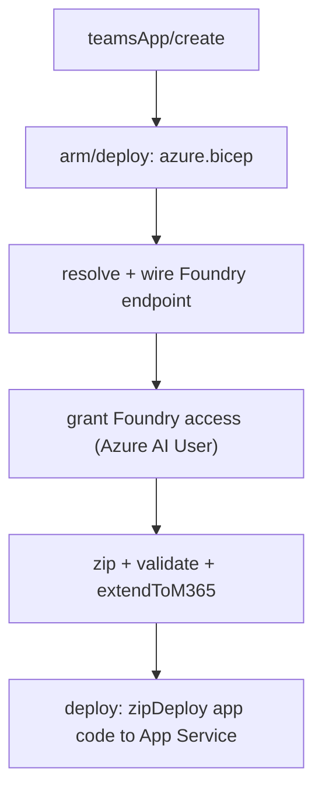
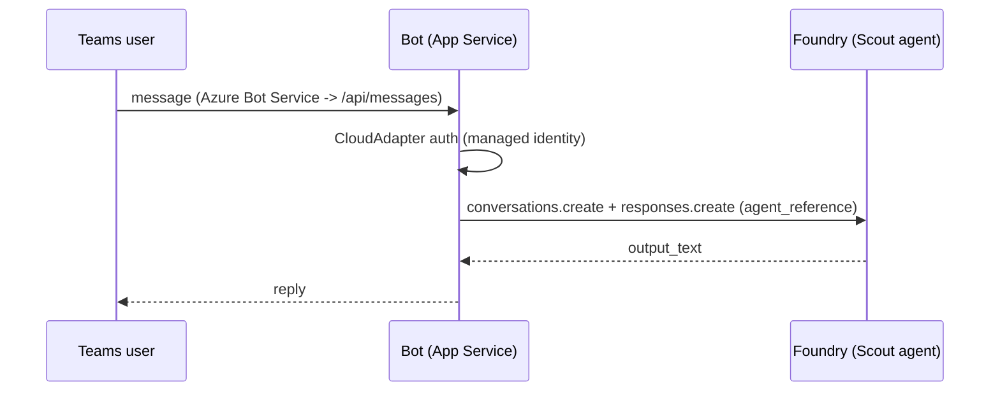
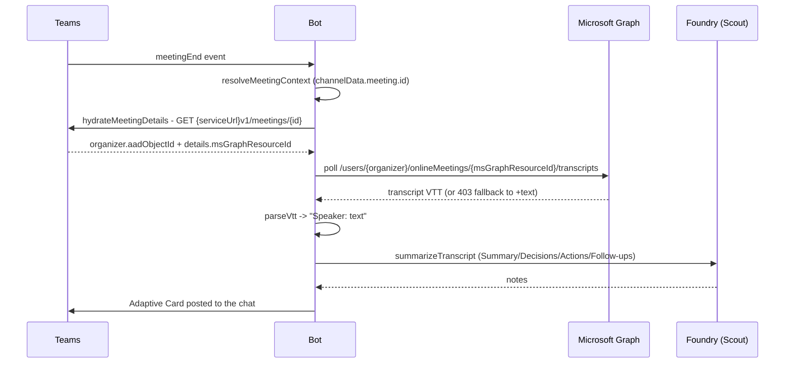

# Overview of the Basic Foundry Agent template

This app template is built on top of [Microsoft 365 Agents SDK](https://github.com/Microsoft/Agents).
It showcases an agent that responds to user questions by connecting to a Microsoft Foundry (formerly Azure AI Foundry) agent using the Responses API.

## Microsoft Foundry Configuration

This template is configured to connect to a Microsoft Foundry agent using agent reference in the Responses API. The configuration requires:

### Prerequisites
- A Microsoft Foundry project with a deployed agent
- Azure credentials configured for `DefaultAzureCredential` (e.g., Azure CLI login, managed identity, or environment variables)
- Required environment variables:
  - `FOUNDRY_PROJECT_ENDPOINT`: Your Foundry project endpoint (e.g., `https://your-resource.services.ai.azure.com/api/projects/your-project`)
  - `FOUNDRY_AGENT_NAME`: The name of your agent in Foundry (e.g., `mail-assistant`)

### Dynamic endpoint resolution (no hardcoded URL)

You don't have to paste the full `FOUNDRY_PROJECT_ENDPOINT` URL. Instead, set the account and
project **names** and the provisioning pipeline resolves the endpoint from the live Azure
resource at deploy time — the same pattern used by the OneGrid reference deployment.

- **What to set** in your env file (`env/.env.dev` or `env/.env.local`):
  - `FOUNDRY_ACCOUNT_NAME`: the Foundry (Cognitive Services / AI Services) account name
  - `FOUNDRY_PROJECT_NAME`: the project under that account (optional; appended as `/api/projects/<name>`)
  - `FOUNDRY_RESOURCE_GROUP`: optional; defaults to `AZURE_RESOURCE_GROUP_NAME`
  - `FOUNDRY_AGENT_NAME`: still required — it's a logical agent name, not derivable from Azure
- **What happens at provision** (see the `resolve + wire Foundry endpoint` step in `m365agents.yml`):
  1. Resolves the endpoint via `az cognitiveservices account show --query properties.endpoint`
     (falling back to a subscription-wide lookup by name).
  2. Persists it back to the env file (`::set-teamsfx-env FOUNDRY_PROJECT_ENDPOINT=...`) so
     later steps and future runs reuse it.
  3. Merges it onto the deployed App Service with `az webapp config appsettings set` (a merge,
     so it never clobbers the other settings the ARM template wrote).
- **Override / reuse**: if `FOUNDRY_PROJECT_ENDPOINT` is already set, it is honored as-is and no
  lookup is performed.
- **Local runs**: `m365agents.local.yml` does the same resolution on a best-effort basis (it
  never fails the run) and writes the value into `.localConfigs` for `npm run dev` / Playground.

### How It Works
The Teams app uses the Azure AI Projects SDK (`@azure/ai-projects`) to:
1. Connect to your Microsoft Foundry project using `AIProjectClient`
2. Retrieve the agent configuration by name
3. Create an Azure OpenAI client from the project
4. Send user messages to the agent using the Responses API with agent reference
5. Return the agent's response to the Teams user

This approach allows you to leverage your existing Foundry agents directly within Microsoft Teams without duplicating agent logic.

## How it works end-to-end

### 0. Two separate deployments

The solution deploys in **two independent steps**, because Azure resources and the Microsoft 365 / Teams app live on different control planes:

| Step | What it deploys | How |
| --- | --- | --- |
| **A. Azure estate** | Web app + Cosmos DB + PostgreSQL + AI Search + Storage + Key Vault + monitoring + **Foundry account, project, and model deployments** | **Deploy to Azure** button (portal) → `deploy/azure/azuredeploy.json`. Pick the subscription/resource group and provide a PostgreSQL admin password. |
| **B. M365 / Teams bot** | App Service + user-assigned managed identity + Azure Bot + Teams channel + Teams app | `atk provision` then `atk deploy` from `m365-agent/` (`m365agents.yml`). |

After step A, copy the Foundry values from the deployment outputs (`aiFoundryEndpoint` / `FOUNDRY_PROJECT_ENDPOINT`) into `m365-agent/env/.env.dev` (or set `FOUNDRY_ACCOUNT_NAME` + `FOUNDRY_PROJECT_NAME` and let step B resolve the endpoint dynamically). Set `FOUNDRY_AGENT_NAME` to your Scout agent.

### 1. Provision / deploy (dynamic config)

When you run Agents Toolkit provision + deploy (`m365agents.yml`) for the bot host:



- **arm/deploy** stands up the App Service + user-assigned managed identity + Bot registration (`infra/azure.bicep`), seeding app settings from the env file.
- **resolve + wire Foundry endpoint**: if `FOUNDRY_PROJECT_ENDPOINT` is blank, it resolves the endpoint from `FOUNDRY_ACCOUNT_NAME` (+ `FOUNDRY_PROJECT_NAME`) via `az cognitiveservices account show`, persists it (`::set-teamsfx-env`), and merges it onto the App Service. The running app gets the endpoint without a hardcoded URL.
- **grant Foundry access** gives the app's managed identity the `Azure AI User` role on the Foundry project — no keys.

### 2. Runtime: a user chats with Scout



- `src/index.ts` boots the `AgentApplication` via the Express host and registers meeting notes.
- `src/agent.ts` handles messages: it builds an `AIProjectClient` (using `ManagedIdentityCredential` in Azure, `az`/`azd` locally), gets the OpenAI client, and calls the existing Foundry agent by reference — so the Teams bot is a thin front door over your Foundry agent, not a copy of its logic.

### 3. Automatic meeting notes

Teams delivers meeting lifecycle as `event` activities. `src/meetingNotes.ts` turns a `meetingEnd` event into an Adaptive Card of notes:



Correctness notes:
- Meeting id comes from `channelData.meeting.id` (never `activity.value`, per Microsoft docs).
- Organizer AAD id + `msGraphResourceId` come from the Teams meeting-details REST call (the Agents SDK has no built-in helper), authenticated with a Bot Framework connector token from `adapter.connectionManager.getTokenProvider(...)`.
- The Graph transcript path uses `msGraphResourceId`, with 403 handling (`SpeakerAttributionNotAllowed` → unattributed text; `GraphAccessToTranscriptsDisabled` → clear admin message).
- Requires the tenant Graph permission `OnlineMeetingTranscript.Read.All` + an application access policy for the organizer, and transcription turned on in the meeting.

## Get started with the template

> **Prerequisites**
>
> To run the template in your local dev machine, you will need:
>
> - [Node.js](https://nodejs.org/), supported versions: 22.
> - [Microsoft 365 Agents Toolkit Visual Studio Code Extension](https://aka.ms/teams-toolkit) latest version or [Microsoft 365 Agents Toolkit CLI](https://aka.ms/teamsfx-toolkit-cli).
> - A Microsoft Foundry project with a deployed agent (e.g., `mail-assistant`)
> - Azure credentials configured (run `az login` if using Azure CLI)

> For local debugging using Microsoft 365 Agents Toolkit CLI, you need to do some extra steps described in [Set up your Microsoft 365 Agents Toolkit CLI for local debugging](https://aka.ms/teamsfx-cli-debugging).

1. First, select the Microsoft 365 Agents Toolkit icon on the left in the VS Code toolbar.
1. Configure your Microsoft Foundry connection in the environment files:
  - In `env/.env.playground.user` (recommended) or `env/.env.playground`, update:
     - `FOUNDRY_PROJECT_ENDPOINT`: Your Foundry project endpoint
     - `FOUNDRY_AGENT_NAME`: Your agent name (default: `mail-assistant`)
1. Ensure you're authenticated to Azure (the app uses `DefaultAzureCredential`):
   ```bash
   az login
   ```
1. Press F5 to start debugging which launches your agent in Microsoft 365 Agents Playground using a web browser. Select `Debug in Microsoft 365 Agents Playground`.
1. You can send any message to get a response from the agent powered by your Microsoft Foundry agent.

**Congratulations**! You are running an agent that can now interact with users in Microsoft 365 Agents Playground using Microsoft Foundry:


## What's included in the template

| Folder       | Contents                                            |
| - | - |
| `.vscode`    | VSCode files for debugging                          |
| `appPackage` | Templates for the application manifest        |
| `env`        | Environment files                                   |
| `infra`      | Templates for provisioning Azure resources          |
| `src`        | The source code for the application                 |

The following files can be customized and demonstrate an example implementation to get you started.

| File                                 | Contents                                           |
| - | - |
|`src/index.ts`| Sets up the agent server.|
|`src/adapter.ts`| Sets up the agent adapter.|
|`src/config.ts`| Defines the environment variables.|
|`src/agent.ts`| Handles business logics for the Basic Foundry Agent.|

The following are Microsoft 365 Agents Toolkit specific project files. You can [visit a complete guide on Github](https://github.com/OfficeDev/TeamsFx/wiki/Teams-Toolkit-Visual-Studio-Code-v5-Guide#overview) to understand how Microsoft 365 Agents Toolkit works.

| File                                 | Contents                                           |
| - | - |
|`m365agents.yml`|This is the main Microsoft 365 Agents Toolkit project file. The project file defines two primary things:  Properties and configuration Stage definitions. |
|`m365agents.local.yml`|This overrides `m365agents.yml` with actions that enable local execution and debugging.|
|`m365agents.playground.yml`| This overrides `m365agents.yml` with actions that enable local execution and debugging in Microsoft 365 Agents Playground.|

## Additional information and references

- [Microsoft 365 Agents Toolkit Documentations](https://docs.microsoft.com/microsoftteams/platform/toolkit/teams-toolkit-fundamentals)
- [Microsoft 365 Agents Toolkit CLI](https://aka.ms/teamsfx-toolkit-cli)
- [Microsoft 365 Agents Toolkit Samples](https://github.com/OfficeDev/TeamsFx-Samples)

## Known issue
- The agent is currently not working in any Teams group chats or Teams channels when the stream response is enabled.
